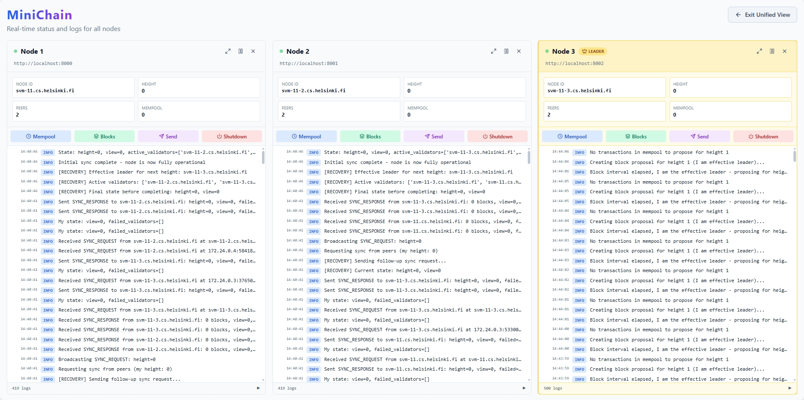
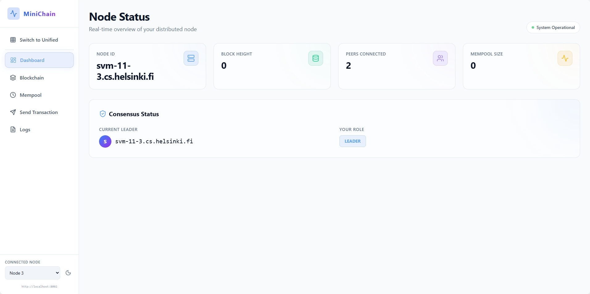

# MiniChain

A simple blockchain implementation for distributed systems demonstration.





## Overview

MiniChain is a minimal blockchain implementation that demonstrates key distributed systems concepts:

- **Shared distributed state**: Replicated blockchain ledger across nodes
- **Data consistency**: Block validation and chain synchronization
- **Consensus**: Round-robin Proof-of-Authority (PoA) consensus
- **Fault tolerance**: Leader crash recovery and node rejoin

## Quick Start

### 1. Quick Start via Docker Compose

You can spin up the API and frontend locally without setting up Python/node manually.

```bash
# From repo root
VITE_API_URL="http://localhost:8080" docker compose up --build
# Frontend: http://localhost:5173
# API:      http://localhost:8080/status
```

Notes:

- Environment variable `VITE_API_URL` points the frontend at the API.
- Compose builds both images and binds ports `5173` (frontend) and `8080` (API).
- See `DOCKER.md` for multi-node, reverse proxy, and TLS guidance.

### 2. Setup (Run once on each VM)

```bash
chmod +x setup.sh
./setup.sh
```

This will:

- Check Python 3.8+ installation (3.11+ recommended)
- Create virtual environment
- Install all dependencies

### 3. Configure Peers

Edit `peers.txt` to include all nodes in your network:

```
svm-11.cs.helsinki.fi:8000
svm-11-2.cs.helsinki.fi:8000
svm-11-3.cs.helsinki.fi:8000
```

**Important**: All nodes must have the same `peers.txt` file with all peers listed.

### 4. Start Node (Run on each VM)

```bash
chmod +x start.sh
./start.sh <hostname> [--clean]
```

**Usage:**

```bash
./start.sh <hostname> [--clean]
```

**Parameters:**

- `hostname`: **REQUIRED** - The hostname of this node (must match one in `peers.txt`)
- `--clean`: Optional flag to clear all data and logs before starting

**Examples:**

On svm-11.cs.helsinki.fi:

```bash
./start.sh svm-11.cs.helsinki.fi
```

On svm-11-2.cs.helsinki.fi:

```bash
./start.sh svm-11-2.cs.helsinki.fi
```

On svm-11-3.cs.helsinki.fi:

```bash
./start.sh svm-11-3.cs.helsinki.fi
```

**Clean Start**: To clear all data and logs before starting:

```bash
./start.sh svm-11.cs.helsinki.fi --clean
```

The script will:

- Use the provided hostname (no auto-detection)
- Find the hostname in `peers.txt`
- Configure node_id and peers automatically
- Start the node

**Note**: Hostname is **required**. The script will exit with an error if not provided.

This will remove:

- All blockchain data (`data/` directory)
- All log files (`minichain.log`)

### 5. Run Frontend (Vite React)

The frontend now supports connecting to multiple backend nodes.

#### Multi-Node Setup (Recommended)

To run a full 3-node network on VMs and access it locally:

1.  **Start Backend Nodes (on VMs)**:

    Open 3 separate terminals on your local machine and run the following commands to start 3 nodes with port forwarding:

    **Node 1 (Port 8001):**

    ```bash
    ssh -L 8001:localhost:8001 -J <user>@melkki.cs.helsinki.fi <user>@svm-11.cs.helsinki.fi
    cd MiniChain/
    ./start.sh svm-11.cs.helsinki.fi --api-port 8001 --no-cli
    ```

    **Node 2 (Port 8002):**

    ```bash
    ssh -L 8002:localhost:8002 -J <user>@melkki.cs.helsinki.fi <user>@svm-11-2.cs.helsinki.fi
    cd MiniChain/
    ./start.sh svm-11-2.cs.helsinki.fi --api-port 8002 --no-cli
    ```

    **Node 3 (Port 8003):**

    ```bash
    ssh -L 8003:localhost:8003 -J <user>@melkki.cs.helsinki.fi <user>@svm-11-3.cs.helsinki.fi
    cd MiniChain/
    ./start.sh svm-11-3.cs.helsinki.fi --api-port 8003 --no-cli
    ```

    _Replace `<user>` with your username._

2.  **Start Frontend (Locally)**:

    ```bash
    cd frontend
    npm install
    npm run dev
    ```

3.  **Access Dashboard**:
    Open `http://localhost:5173` in your browser.

### 5. Quick Start via Docker Compose

You can spin up the API and frontend locally without setting up Python/node manually.

```bash
# From repo root
VITE_API_URL="http://localhost:8080" docker compose up --build
# Frontend: http://localhost:5173
# API:      http://localhost:8080/status
```

Notes:

- Environment variable `VITE_API_URL` points the frontend at the API.
- Compose builds both images and binds ports `5173` (frontend) and `8080` (API).
- See `DOCKER.md` for multi-node, reverse proxy, and TLS guidance.

#### Switching Nodes

The frontend includes a node selector in the sidebar. You can switch between the connected nodes to view the state of different parts of the network.

- **Default Nodes**: The frontend is configured to connect to `localhost:8001`, `localhost:8002`, and `localhost:8003` by default.
- **Adding More Nodes**: To add or modify nodes, edit `frontend/src/nodeConfig.js`.

```javascript
// frontend/src/nodeConfig.js
export const nodes = [
  { id: "node1", name: "Node 1", url: "http://localhost:8001" },
  // ... add more nodes here
];
```

## Configuration

### `config.yaml` - Blockchain Settings

Edit `config.yaml` to adjust blockchain and consensus parameters:

```yaml
consensus:
  block_interval: 5 # Seconds between block proposals
  proposal_timeout: 10 # Seconds to wait for ACKs
  quorum_size: 2 # Minimum ACKs needed (for 3 nodes: 2/3)

blockchain:
  max_block_size: 100 # Max transactions per block

logging:
  level: "INFO" # DEBUG, INFO, WARNING, ERROR, CRITICAL
  file: "minichain.log"
  console: true
```

**Note**: This file contains only blockchain settings. Node-specific settings (node_id, peers) are auto-detected from `peers.txt`.

### API Port

The HTTP API binds to `0.0.0.0` and defaults to the port derived from `peers.txt` (falls back to `8000`). You can explicitly set an API port when starting:

```bash
./start.sh <hostname> --api-port 8080
```

### `peers.txt` - Network Configuration

List all nodes in your network (one per line, format: `hostname:port`):

```
svm-11.cs.helsinki.fi:8000
svm-11-2.cs.helsinki.fi:8000
svm-11-3.cs.helsinki.fi:8000
```

The `start.sh` script automatically:

- Detects which machine it's running on
- Sets node_id to the matching hostname
- Configures peers (all other nodes in the list)

## CLI Interface

When you start a node, an interactive CLI automatically launches. Use it to submit transactions and monitor the blockchain.

### Available Commands

#### `help` or `h`

Show help message with all available commands.

#### `submit <sender> <recipient> <amount>`

Submit a new transaction to the blockchain.

**Example:**

```
minichain> submit alice bob 10.5
✓ Transaction submitted: a1b2c3d4e5f6g7h8
  alice -> bob: 10.5
```

#### `status` or `info`

Display current node status and blockchain information.

```
minichain> status
============================================================
Node Status
============================================================
Node ID:        svm-11.cs.helsinki.fi
Hostname:       svm-11.cs.helsinki.fi
Port:           8000
Blockchain Height: 5
Latest Block Hash: 1a2b3c4d5e6f7g8h9...
Mempool Size:   3 transactions
Connected Peers: 2
Current Leader: svm-11-2.cs.helsinki.fi
I am Leader:    No (for next block)
============================================================
```

#### `chain [limit]`

Show a summary of recent blocks (default: 10).

```
minichain> chain 5
```

#### `block <height>`

Show detailed information about a specific block.

```
minichain> block 5
```

#### `mempool` or `pool`

Show pending transactions in mempool.

#### `peers`

Show connected peer nodes.

#### `logs [n]`

Show last n lines from log file (default: 20).

```
minichain> logs 50
```

**Note**: Use `--log-level DEBUG` when starting to see debug logs:

```bash
./start.sh --log-level DEBUG
```

#### `clear`

Clear screen.

#### `exit`, `quit`, or `q`

Exit the node.

## Architecture

The project is organized into the following modules:

- `src/common/`: Configuration, logging, and cryptographic utilities
- `src/chain/`: Blockchain data structures (Block, Transaction) and chain management
- `src/mempool/`: Transaction mempool for pending transactions
- `src/consensus/`: Consensus mechanism (round-robin PoA)
- `src/p2p/`: Peer-to-peer networking and message passing
- `src/node/`: Main node implementation that orchestrates all components
- `src/cli/`: Interactive command-line interface

## Features

### Consensus

- **Round-robin PoA**: Leaders rotate based on block height
- **Quorum-based**: Requires majority ACKs before committing blocks
- **View change**: Automatic leader rotation on timeout

### Networking

- **TCP-based**: Reliable message delivery
- **Gossip protocol**: Transaction and block propagation
- **State synchronization**: Catch-up sync for new/rejoining nodes

### Blockchain

- **Genesis block**: Automatically created on first run (deterministic)
- **Block validation**: Height, hash, and linkage checks
- **Fork resolution**: Longest chain wins

## Project Structure

```
MiniChain/
├── src/
│   ├── common/          # Utilities (config, logging, crypto)
│   ├── chain/           # Blockchain data structures
│   ├── mempool/         # Transaction mempool
│   ├── consensus/       # Consensus algorithms
│   ├── p2p/             # Network communication
│   ├── node/            # Main node implementation
│   ├── cli/             # CLI interface
│   └── main.py          # Entry point
├── config.yaml          # Blockchain configuration
├── peers.txt            # Network peers (all nodes)
├── setup.sh             # Setup script
├── start.sh             # Start script (auto-configures)
├── requirements.txt     # Python dependencies
└── README.md           # This file
```

## How It Works

### Transaction Flow

1. **Transaction Submission**: User submits transaction via CLI
2. **Gossip Propagation**: Transaction is broadcast to all peers
3. **Mempool**: All nodes add transaction to their mempool
4. **Block Proposal**: Leader creates block from mempool transactions
5. **Validation**: Followers validate and ACK the proposal
6. **Commit**: Leader commits block after quorum is reached
7. **Finalization**: All nodes add block to their blockchain

### Message Types

- **TX**: Transaction propagation (gossip)
- **PROPOSE**: Block proposal from leader
- **ACK**: Acknowledgment from followers (sent to leader only)
- **COMMIT**: Final commit message from leader
- **HELLO**: Connection handshake

### Consensus Process

1. Leader rotates based on block height (round-robin)
2. Leader proposes block when `block_interval` elapsed
3. Followers validate and send ACK to leader
4. Leader waits for quorum (majority of validators)
5. Leader commits and broadcasts COMMIT
6. All nodes finalize the block

## Troubleshooting

### Node Not Starting

- Check Python version: `python3 --version` (needs 3.8+)
- Ensure virtual environment is activated
- Check `peers.txt` contains the current machine's hostname

### Connection Issues

- Verify hostnames in `peers.txt` are resolvable: `ping <hostname>`
- Check firewall settings allow connections on port 8000
- Ensure all nodes are running

### Consensus Issues

- Verify all nodes have the same `peers.txt` file
- Check that hostnames match exactly (FQDN vs short name)
- Use `--log-level DEBUG` to see detailed logs

### View Logs

```bash
# View logs via CLI
minichain> logs 50

# Or view log file directly
tail -f minichain.log
```

## Advanced Usage

### Run Without CLI

```bash
python3 src/main.py --no-cli --node-id <id> --peers "..."
```

### Custom Configuration

You can still override settings via command-line:

```bash
python3 src/main.py \
  --node-id custom-id \
  --port 8001 \
  --peers "peer1:8000,peer2:8000" \
  --log-level DEBUG \
  --config custom_config.yaml
```

## Testing

MiniChain ships with a lightweight `pytest` suite that exercises the block/mempool primitives, blockchain persistence, and consensus helpers. Run it from the repo root **after activating the project virtual environment** so that dependencies such as `msgpack`, `cryptography`, and `pytest` are available:

```bash
source .venv/bin/activate  # created via ./setup.sh
pip install -r requirements.txt  # no-op if already installed
pytest -q                      # or python -m pytest
```

Tests live under `tests/` and can be filtered (e.g., `pytest tests/test_poa.py -k quorum`). The suite expects the dependencies listed in `requirements.txt`—rerun `setup.sh` if the environment gets out of sync.

## Documentation

- `docs/ARCHITECTURE.md` – runtime wiring, lifecycles, and extension points.
- `PRD.md` – product requirements, personas, milestones, and risks.
- `TODO.md` – backlog aligned with the PRD milestones.
- `PYTEST.md` – detailed instructions for running/extending the automated test suite.
- `docs/CURL.md` – curl examples and SSH tunneling tips (`--api-port` examples).
- `DOCKER.md` – step-by-step Docker and Compose deployment guide.

Keep these documents in sync when features land so reviewers can trace code back to the design intent.

## Development

The codebase is designed to be:

- **Modular**: Each component is independent
- **Configurable**: Easy to adjust for different deployments
- **Extensible**: Easy to add new features

## License

[Your License Here]

## API Reference

MiniChain includes an HTTP API for interacting with the node and debugging. To enable it, start the node with the `--api-port` flag:

```bash
./start.sh <hostname> --api-port 8080
# OR
python3 src/main.py --node-id <id> --api-port 8080
```

### Standard Endpoints

#### Check Node Status

```bash
curl http://localhost:8080/status
```

#### List Blocks

```bash
curl "http://localhost:8080/blocks?limit=5"
```

#### Get Block Details

```bash
curl http://localhost:8080/blocks/0
```

#### Submit Transaction

```bash
curl -X POST http://localhost:8080/submit \
  -H "Content-Type: application/json" \
  -d '{"sender": "alice", "recipient": "bob", "amount": 10.5}'
```

#### Get Transaction Details

```bash
curl http://localhost:8080/transactions/<tx_id>
```

#### View Mempool

```bash
curl http://localhost:8080/mempool
```

### Debug Endpoints

These endpoints are for testing edge cases and simulating network conditions.

#### Clear Mempool

Remove all pending transactions from the mempool.

```bash
curl -X POST http://localhost:8080/debug/mempool/clear
```

#### Simulate Network Partition

Disconnect from all peers to simulate a network partition.

```bash
curl -X POST http://localhost:8080/debug/network/disconnect
```

#### Reconnect Network

Reconnect to peers after a partition.

```bash
curl -X POST http://localhost:8080/debug/network/reconnect
```

#### Trigger Consensus Timeout

Simulate a consensus timeout (e.g., to force a view change).

```bash
curl -X POST http://localhost:8080/debug/consensus/timeout
```

### Node Control & Logs

#### Shutdown Node

```bash
curl -X POST http://localhost:8080/shutdown
```

#### Peers Status

```bash
curl http://localhost:8080/peers/status
```

#### Request Sync

```bash
curl -X POST http://localhost:8080/sync/request
```

#### Fetch Logs

```bash
curl "http://localhost:8080/logs?lines=100&level=INFO&tail=true" | jq .
```

#### Stream Logs (SSE)

```bash
curl -N "http://localhost:8080/logs/stream?level=INFO"
```

## Docker (Quick Start)

You can run the API and frontend via Docker Compose. See `DOCKER.md` for full details.

```bash
# From repo root
VITE_API_URL="http://localhost:8080" docker compose up --build
# Frontend: http://localhost:5173
# API:      http://localhost:8080/status
```

For Internet deployment, use a public VM with a reverse proxy and TLS; `DOCKER.md` includes guidance and an optional Nginx setup.

## Remote Access (UH VPN + SSH Gateway)

Recommended setup using a VPN and SSH jump host to reach `svm-11*` machines from your laptop.

1. Connect to UH VPN:

- Guide: https://helpdesk.it.helsinki.fi/en/logging-and-connections/remote-access-university-services

2. SSH with local port forwarding via gateway:

```bash
# Single command using jump host (-J)
ssh -L 5173:localhost:5173 -L 8000:localhost:8000 \
  -J <user>@melkki.cs.helsinki.fi <user>@svm-11.cs.helsinki.fi
```

Notes:

- `-J` uses the gateway as a jump host.
- You can replace `melkki` with `melkinkari` or `melkinpaasi`.
- Manual chaining also works (SSH to gateway first, then to `svm-11`).

3. On `svm-11`, start backend + frontend:

```bash
cd ~/MiniChain
./start.sh svm-11.cs.helsinki.fi --api-port 8000
cd frontend
VITE_API_URL="http://localhost:8000" npm run dev -- --host
```

4. On your local machine, open:

- Frontend: `http://localhost:5173`
- API health: `http://localhost:8000/status`

This avoids firewall issues by tunneling through SSH.

### Direct Access inside UH network

If you’re already on the UH network and want to access directly:

1. Ensure Vite binds to `0.0.0.0` (see `frontend/vite.config.js` with `server.host: true`).

2. Start frontend pointing at the VM IP:

```bash
VITE_API_URL="http://128.214.11.91:8000" npm run dev -- --host
```

3. Open `http://128.214.11.91:5173/` from your host.

If it doesn’t load:

- Open ports on the VM firewall:

```bash
sudo ufw allow 5173/tcp
sudo ufw allow 8000/tcp
sudo ufw status
```

- Check listeners:

```bash
ss -ltnp | grep 5173
ss -ltnp | grep 8000
```

- Institutional firewall may still block; fall back to the SSH tunnel method above.

If you run into errors with the jump host command, share the exact error and we’ll adjust (e.g., `ProxyJump` in `~/.ssh/config`, or `-W`/`-J` alternatives).

## Troubleshooting

### API Not Working

If you cannot access the API:

1.  **Check if node is running**:
    ```bash
    ps aux | grep main.py
    ```
2.  **Check if port is listening**:
    ```bash
    netstat -tulpn | grep 8080
    ```
3.  **Check logs**:
    ```bash
    tail -f minichain.log
    ```
4.  **Missing Dependencies**:
    If you see `ModuleNotFoundError`, run:
    ```bash
    ./setup.sh
    ```

### Connection Refused (502)

If accessing from a local machine via SSH tunnel:

- Ensure the node is running on the **remote** machine.
- Ensure the tunnel is correctly set up: `ssh -L 8080:localhost:8080 user@host`
- Verify the node is listening on `0.0.0.0` or `localhost` (default is `0.0.0.0`).
