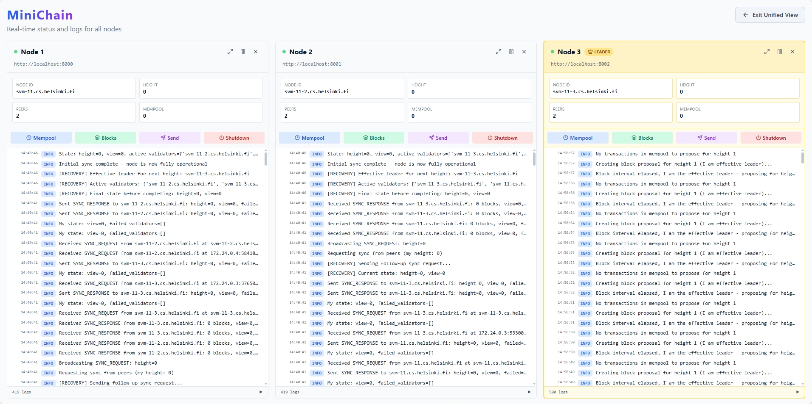
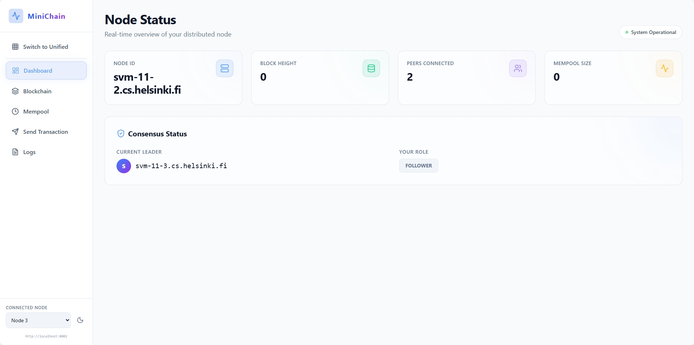
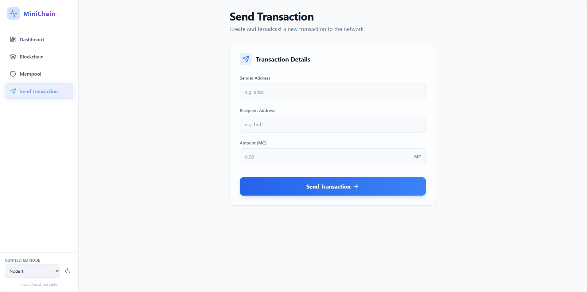
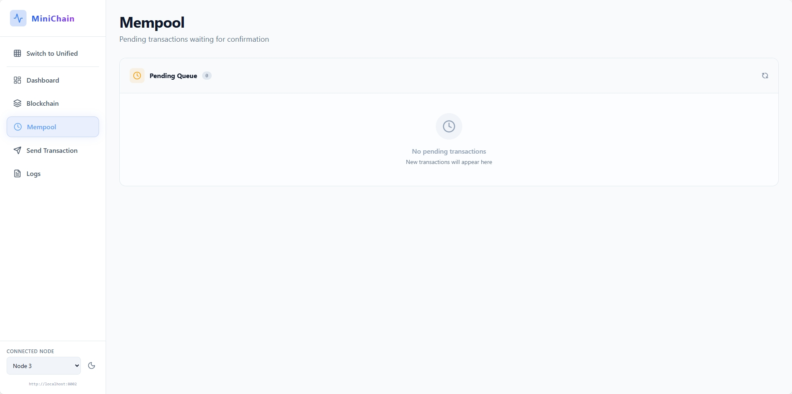
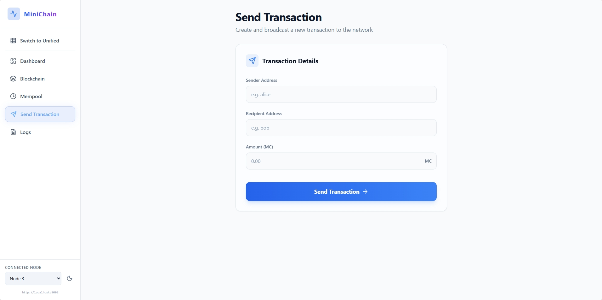
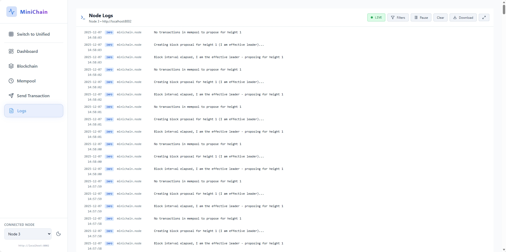

# MiniChain Frontend

This is the frontend application for MiniChain, a simple blockchain implementation. It allows users to view blocks, transactions, and interact with the blockchain network.













## Development

This project uses React and Vite.

### Official Plugins

- [@vitejs/plugin-react](https://github.com/vitejs/vite-plugin-react/blob/main/packages/plugin-react) uses [Babel](https://babeljs.io/) (or [oxc](https://oxc.rs) when used in [rolldown-vite](https://vite.dev/guide/rolldown)) for Fast Refresh
- [@vitejs/plugin-react-swc](https://github.com/vitejs/vite-plugin-react/blob/main/packages/plugin-react-swc) uses [SWC](https://swc.rs/) for Fast Refresh

### React Compiler

The React Compiler is not enabled on this template because of its impact on dev & build performances. To add it, see [this documentation](https://react.dev/learn/react-compiler/installation).

### Expanding the ESLint configuration

If you are developing a production application, we recommend using TypeScript with type-aware lint rules enabled. Check out the [TS template](https://github.com/vitejs/vite/tree/main/packages/create-vite/template-react-ts) for information on how to integrate TypeScript and [`typescript-eslint`](https://typescript-eslint.io) in your project.

## Highlights

- Modern React (Vite) UI for MiniChain nodes
- Multi-node selector to switch between backends
- Live logs via SSE, block/mempool views, transaction submit + details
- Configurable API base via `VITE_API_URL`

## Requirements

- Node.js 18+
- npm 9+ (or pnpm/yarn)

## Getting Started

### Clone

```bash
git clone <repo-url>
cd MiniChain/frontend
```

### Install dependencies

```bash
npm install
```

### Configure environment

- Default: connects to `http://localhost:8001`, `8002`, `8003` via `src/nodeConfig.js`
- Override API base for single-node dev:

```bash
VITE_API_URL="http://localhost:8080" npm run dev
```

### Run the dev server

```bash
npm run dev
```

### Other npm scripts

```bash
npm run build      # production build
npm run preview    # preview local build
npm run lint       # run eslint
```

## Project Layout

```
frontend/
├── src/
│   ├── api/            # axios client + mocks
│   ├── components/     # shared UI components
│   ├── context/        # Node/Theme/View contexts
│   ├── hooks/          # polling and helpers
│   ├── pages/          # Dashboard, Blocks, Mempool, Logs, etc.
│   └── nodeConfig.js   # default nodes
└── public/
```

## Daily Development Workflow

- Start backend nodes (API enabled)
- Set `VITE_API_URL` or edit `src/nodeConfig.js`
- Run `npm run dev` and iterate on pages/components
- Use Logs page to debug live behavior

## Backend Contract

- Status: `GET /status`
- Blocks: `GET /blocks`, `GET /blocks/{height}`
- Mempool: `GET /mempool`
- Submit: `POST /submit`
- Transaction: `GET /transactions/{tx_id}`
- Logs: `GET /logs`, `GET /logs/stream`
- Peers: `GET /peers/status`
- Sync: `POST /sync/request`
- Shutdown: `POST /shutdown`

## TinySearch Quickstart

- Use the Dashboard search to quickly navigate blocks/transactions (if enabled)
- Hook into `getBlocks` and `getTransactionDetails` to power search results

## UI Surfaces & Capabilities

- Dashboard: node status, leader, height
- Blocks: recent blocks and details
- Mempool: pending transactions
- Send Transaction: form to submit TX
- Logs: SSE live stream with filters and download
- Node Selector: switch backend targets

## Auth & Security

- Development mode assumes trusted local access
- For production, place API behind reverse proxy + TLS
- Consider auth on control endpoints (`/shutdown`, `/sync/request`)

## Testing

- Unit tests can be added with Vitest/Jest (not included)
- Lint with `npm run lint`

## Docker & Compose

- See root `DOCKER.md` for running frontend + API via Compose

## Documentation & Support Material

- Root `README.md` and `docs/ENDPOINT.md` for API details
- `docs/CURL.md` for endpoint examples

## Troubleshooting

- If the UI can’t reach the API, check:
  - `VITE_API_URL` value and CORS
  - Backend port listening and SSH tunnel
  - Browser console/network tab for errors

## Changelog & License

- Track changes in repository commits
- License: see root `README.md` (placeholder)
